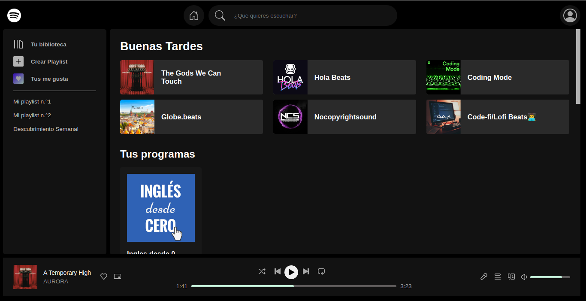
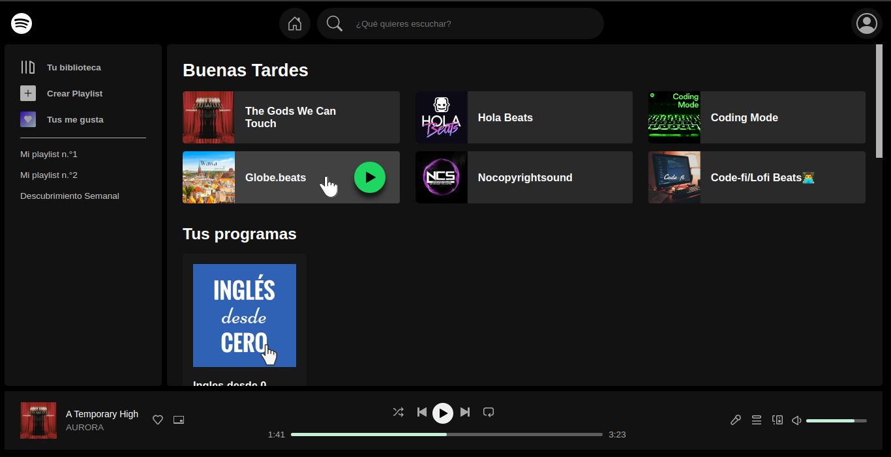
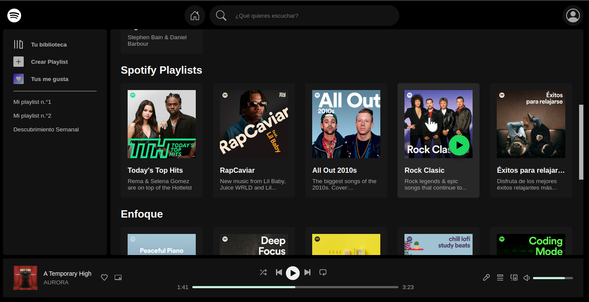
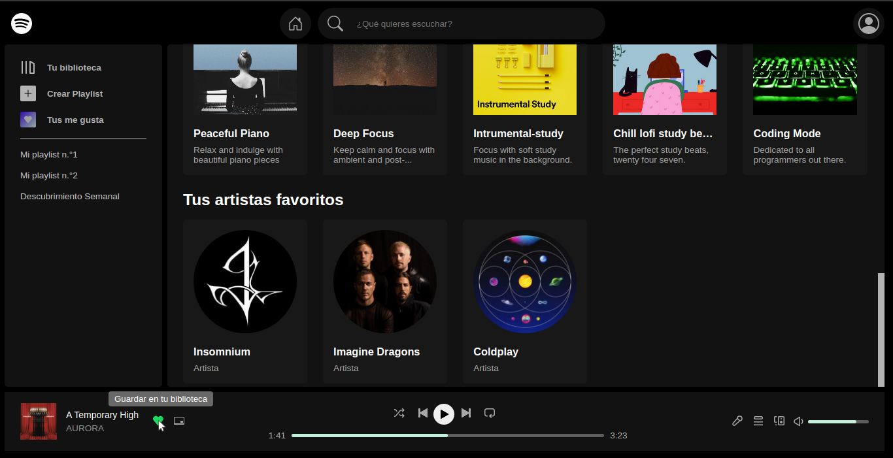
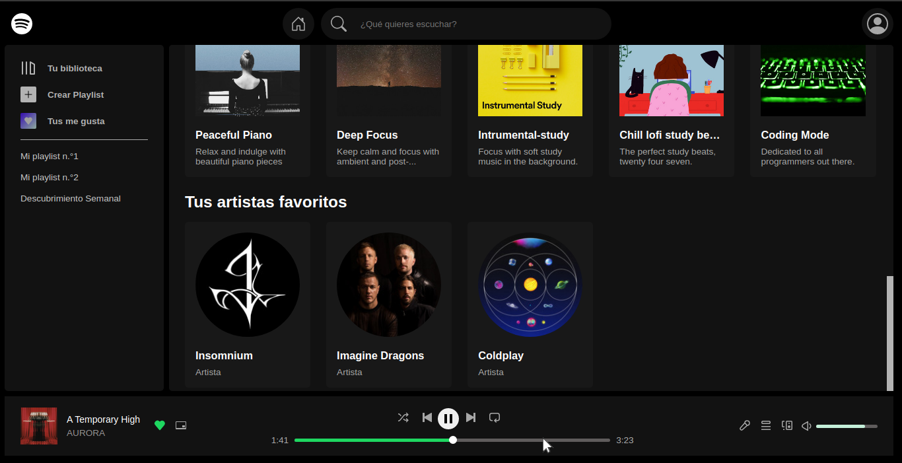

# Interfaz principal de Open Spotify

La aplicacion de Open Spotify no tiene diseño responsivo para pantallas como celulares, tanto en la aplicación real como en esta simulación. El responsive esta aproximadamente desde los 760px de ancho hacia arriba.

Se trató de copiar la mayoria de los detalles que fueran posibles hacerlo solo con HTML y CSS puro por lo cual carece de dinamismo, los botones y los textos  no llevan a ninguna parte. 

Con esta práctica, reforcé conocimientos en **Maquetación, "responsividad", Flex-box, Grid CSS, Transiciones, imagenes responsivas, etc.**

### Link del proyecto [Aquí](https://miktl.github.io/interfaz-open-spotify/)

## Capturas de la interfaz:

### General

### Al poner o pasar el cursor encima de los elementos recientes

### Al poner o pasar el cursor encima de las tarjetas

### Al poner y hacer click en el corazon de favoritos

### Al poner o pasar el cursor por la barra de progreso

